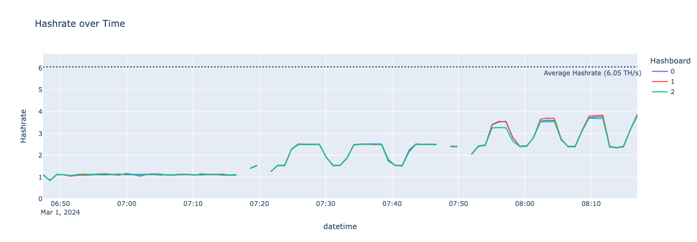
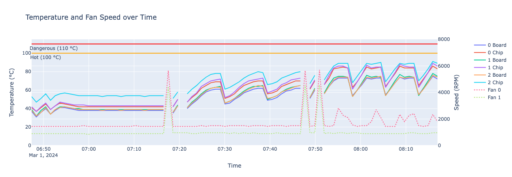

# pyasic_dashboard

_An interactive dashboard for visualizing [pyasic](https://github.com/UpstreamData/pyasic) data._

---

### Demo

[pyasic.tools](https://pyasic.tools/)

---

### Installation

`poetry install`

---

### Dashboard

If you have [saved miner data to SQLite](#saving-data), you can analyze it with interactive python visualizations in a plotly [dash](https://dash.plotly.com/) app.

- `python pyasic_dashboard/app.py examples/change_power.db`
- Go to `http://localhost:8050/` in your browser
- Currently, provides basic functionality of the [Braiins OS+ dashboard](https://youtu.be/-RiUFCiVPEs?si=D6ttU9vM8B5t3V5I&t=131) with overall status, hashrate, and temperature
- More visualizations planned in future

##### Status

<!--  -->


##### Hashrate

<!--  -->


##### Temperature

<!--  -->


---

### Saving Data

Miner data can be saved to a SQLite database or CSV file. Data is preprocessed as a pandas dataframe where dicts for hashboard/fan data are flattened.

```python
import asyncio
from pyasic import get_miner
from pyasic_dashboard.db import write_data

if __name__ == "__main__":
    miner = await get_miner(ip="192.168.1.75")  # update ip address
    asyncio.run(
        write_data(
            miner=miner,
            data_file="miner_data.db",  # Use .csv extension to save as CSV file
            sleep_mins=1,  # Number of minutes to wait between writes
        )
    )
```

Alternatively, you can use the command `python pyasic_dashboard/db/save_data.py 192.168.1.75 miner_data.db 1`

---

### Example Notebooks

- [Saving data](examples/write_data.ipynb)
- [Changing power](examples/change_power.ipynb)

---
